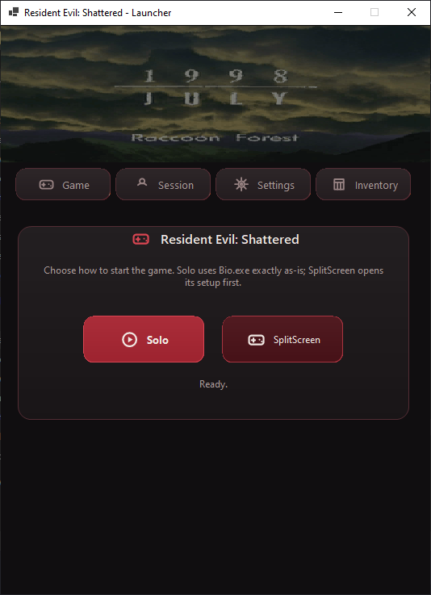
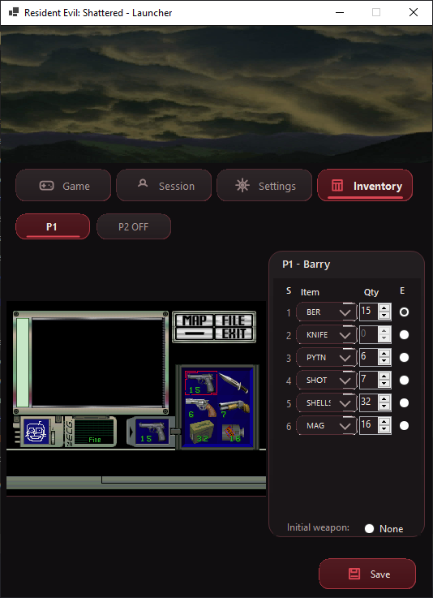
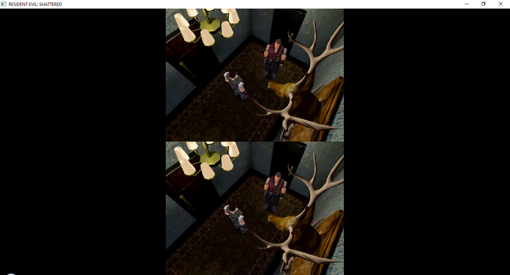

# RESIDENT EVIL: SHATTERED

**RESIDENT EVIL: SHATTERED** is an early closed-source fan project built around sharing the classic Resident Evil survival-horror experience with friends.

This public repository is used for public test builds, screenshots, installation notes, issue tracking, and community-facing documentation. The active source code, internal tools, and development assets are maintained privately.

## Screenshots

| Launcher                                                                                         | Inventory Setup                                                                                              |
| ------------------------------------------------------------------------------------------------ | ------------------------------------------------------------------------------------------------------------ |
|  |  |

  

  <strong>v0.0.2 public test build with expanded menus, gameplay, and experimental multiplayer modes.</strong> 
  SHATTERED is still in active development, and public builds may contain incomplete behavior, bugs, and compatibility issues.

## Project Status

SHATTERED is currently an early public test build.

The current public release is intended for testing the launcher, basic startup flow, supported game-data layout, and experimental gameplay features. Features may change frequently between builds.

## Downloads

The current public test build, **v0.0.3**, is available on the repository's **Releases** page.

The multiplayer menu is visible but not functional yet. SplitScreen is currently the only working multiplayer mode, and the public package contains only the launcher and client.

> No original Resident Evil game assets are included in this repository or in public releases.

## Installation

For setup instructions, supported game data, and the expected launcher folder layout, see [INSTALL.md](INSTALL.md).

## Requirements

To use SHATTERED, you must provide your own legally obtained copy of the required Resident Evil 1 game data.

Additional requirements may vary by release and will be documented alongside each build.

## Reporting Issues

Use the **Issues** tab to report crashes, launcher problems, setup issues, compatibility problems, or behavior differences seen in the current public build.

When reporting a bug, please include:

- SHATTERED version or build
- Windows version
- supported game data version used
- whether you launched in Solo or SplitScreen mode
- steps to reproduce the issue
- screenshots or logs if available

## Source Code

SHATTERED is a closed-source project.

The public repository does not contain the active source code, internal research branches, private tools, or development assets. Public releases and documentation are provided for users, testers, and project tracking.

## Legal Notice

RESIDENT EVIL is a trademark of Capcom.

RESIDENT EVIL: SHATTERED is an unofficial fan project and is not affiliated with, endorsed by, sponsored by, or approved by Capcom.

This project does not distribute original game assets, copyrighted data files, or commercial game content. Users are responsible for providing their own legally obtained game data where required.

## Links

- [Installation Guide](INSTALL.md)
- [Releases](https://github.com/Depmify/Resident-Evil-SHATTERED/releases)
- [Issues](https://github.com/Depmify/Resident-Evil-SHATTERED/issues)
